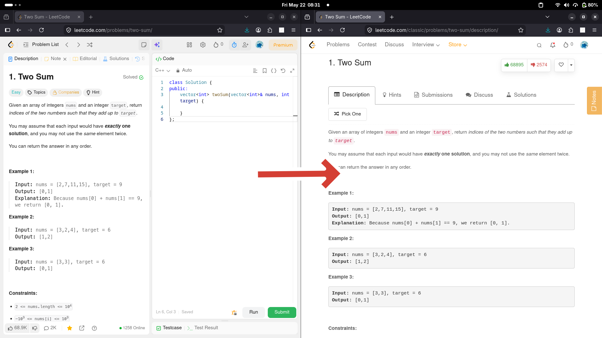

    

    <b>LeetCode Classic</b> - A browser extension to view <a href="https://leetcode.com/">LeetCode</a> programming problems in old web UI.

    <b>Available on</b>

|  |  |  |  |  |  |
| :-: | :-: | :-: | :-: | :-: | :-: |
| Chrome | Edge | Firefox | Opera | Vivaldi | Brave |

## Screenshot

## Demo

<video src="assets/demo/demo.mp4" controls></video>

## Limitations

This extension relies on LeetCode's platform continuing to serve the classic UI at the `/classic/` URL path. If LeetCode removes or deprecates this endpoint, the extension will no longer function as intended.
